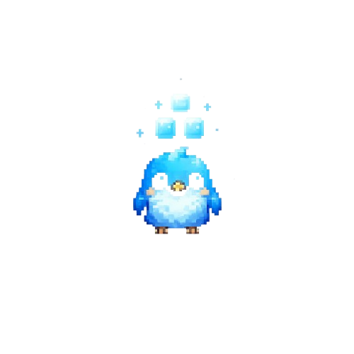
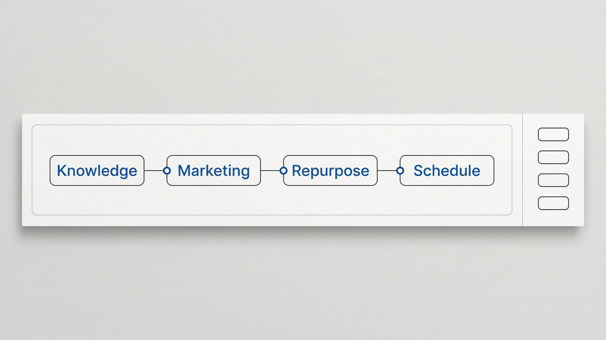
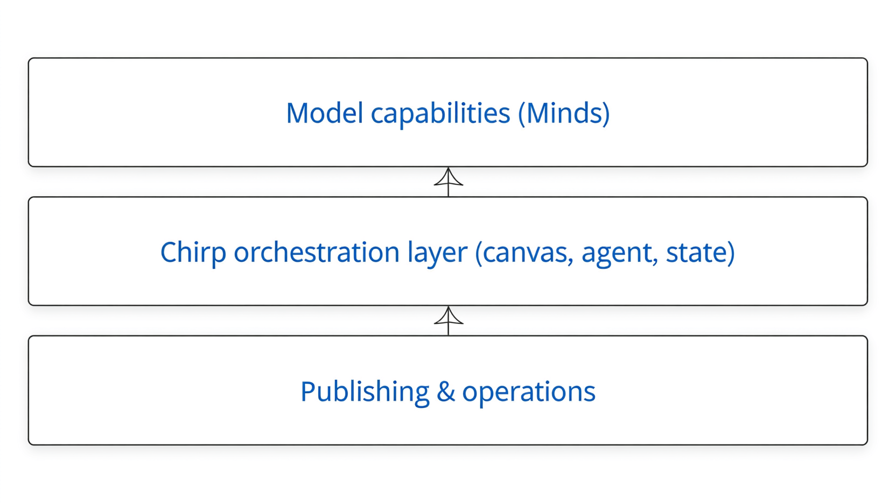
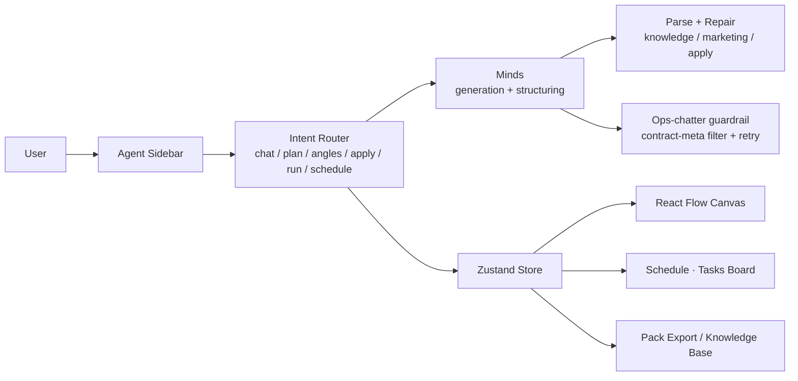
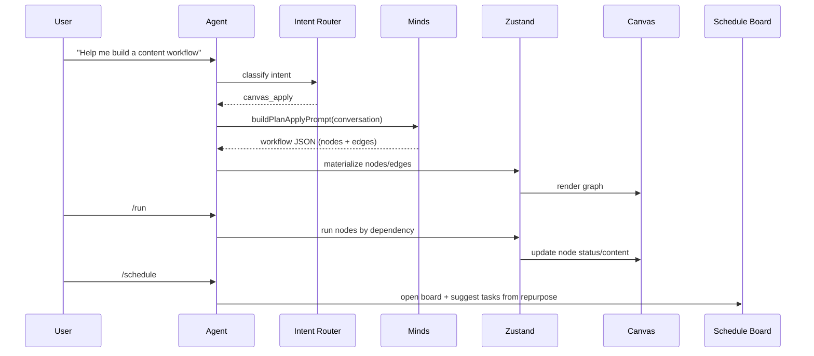
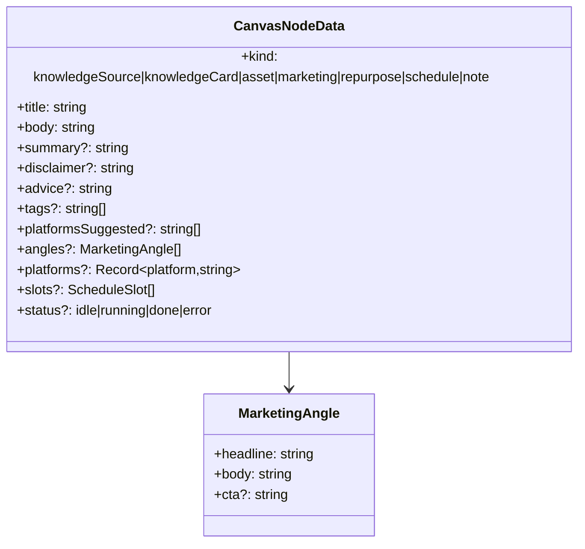

<div align="center">
  
  &nbsp;&nbsp;
  
  <h1>Chirp</h1>
  <p><strong>Orchestrate content, don’t just generate it.</strong></p>
  <p>One canvas: Knowledge → Marketing → Repurpose → Schedule.</p>

  <p>
    
    
    
    
    
    
  </p>

  <p><em>中文摘要：一张画布跑通内容工作流，Agent 直接驱动。</em></p>
</div>

---

## Quick Start

```bash
pnpm install
pnpm dev
```

Requires:

```bash
MINDS_BUILDER_API_KEY=...
MINDS_MIND_ID=...
```

<p align="center">
  
</p>

## Problem — Context Hell

Strategy lives in scattered chat threads, Telegram groups, and docs. Every conversation feels like a **restart** — no shared state, no reusable output, manual scheduling.

| Before | After |
| --- | --- |
| Fragments across Chat / TG / docs | One executable canvas workflow |
| Re-generate from scratch each time | Knowledge, angles, copy, schedule compound |
| Manual, untraceable handoffs | Dependencies and provenance on the graph |

## Why vertical, not “just call a model”

AI short-drama teams don’t stop at a single image call — they **orchestrate** an entire episode in a workbench. Content creation is the same. Chirp is a **vertical workbench for content creators**, built on **Minds**: brand knowledge, marketing angles, cross-platform repurposing, and scheduling become one executable chain.

<details>
<summary><strong>Market &amp; vision</strong></summary>

- The creator economy needs **reusable, collaborative, measurable** content operations, not scattered generation.
- A canvas-first core supports **integration and extension**: scheduling, publishing, analytics loops, collaboration, more platforms.
- **Vision:** the **orchestration layer** for content — models upstream, publishing/ops downstream, and a durable layer of reusable knowledge in between.

<p align="center">
  
</p>

</details>

## What you can do

| Capability | What you get | Command |
| --- | --- | --- |
| Plan | Step-by-step plan (direction / steps / canvas suggestions) | `/plan` |
| Angles | 3 marketing angles written into a marketing node | `/angles` |
| Apply | Land the plan as nodes + edges | `/apply` |
| Run | Execute the pipeline by dependency order | `/run` |
| Schedule | Open the Schedule · Tasks board (schedule-only) | `/schedule` |

## Architecture



<details>
<summary><strong>Data flow &amp; domain model</strong></summary>





</details>

## Engineering depth

<details>
<summary><strong>Intent routing, structured generation, guardrails, persistence, testing</strong></summary>

- **Intent routing & canvas awareness** — slash commands + regex map to `chat | plan | deliverable_angles | canvas_apply | canvas_run | canvas_schedule | help`; a canvas context (`buildCanvasContext`) injects node kinds, counts, selection, knowledge entries, and board tasks into prompts.
- **Structured generation with parse + repair** — knowledge cards, marketing `angles[]`, and apply JSON are parsed and repaired once on failure (`KNOWLEDGE_REPAIR_SUFFIX`, `MARKETING_REPAIR_SUFFIX`, `APPLY_REPAIR_SUFFIX`).
- **Quality guardrails** — contract/ops chatter detection (`isContractMetaReply`) across chat/plan/marketing/apply; one repair, then a friendly on-topic fallback instead of surfacing PIVOT/TASK text. Prompt-level bans on TASK-prefix, contract IDs, PIVOT-Ops.
- **State & persistence** — Zustand holds projects, canvases, knowledge entries, and board tasks, persisted to `localStorage` (`chirp-store`); per-project Minds conversation alias (`chirp-${slug}-${Date.now()}`) via `/api/minds/init`; pack export (JSON/Markdown).
- **Reliability & testing** — timeouts + single-repair retries; typed failure modes (`marketing-unusable`, `apply-unusable`, `insufficient-upstream`); offline asserts in `scripts/assert-node-content.ts`; probe scripts `scripts/probe-node-quality.mjs`, `scripts/probe-matrix-full.mjs`.

</details>

## Quality & Reliability

- Intent routing + structured parsing + repair
- Ops-chatter guardrail so “task walls” never surface
- Offline asserts for node content structure

## Deploy

Vercel: set the two Minds variables above. Same-origin env; avoid `NEXT_PUBLIC_APP_URL` unless you actually use it.

## Roadmap / Demo

- Demo video (in progress)
- More platforms, team collaboration, publishing integrations

## Team / Acknowledgements / Hackathon

- Team: Chirp
- Thanks: Minds by Animoca Brands, React Flow, Vercel
- Built for a hackathon exploring vertical content-creation workflows on a canvas

---

> Illustrations generated with Alibaba DashScope (Qwen-Image) in an IKEA-manual line style for this README.
