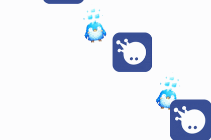
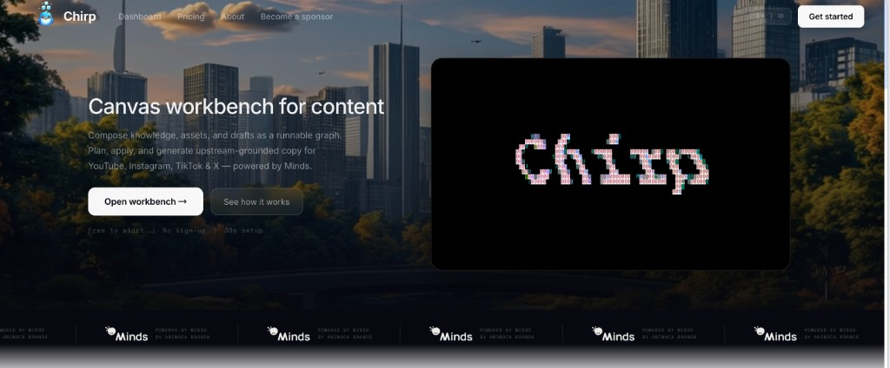
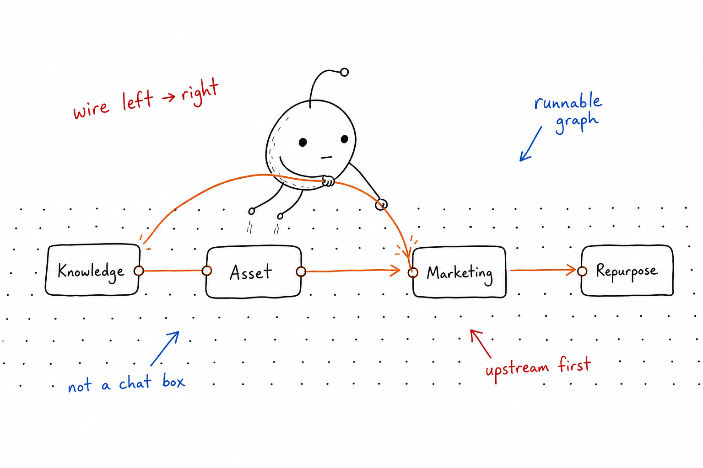
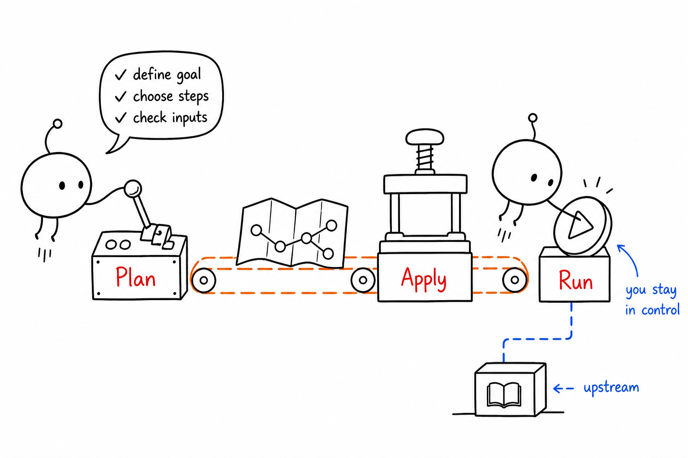
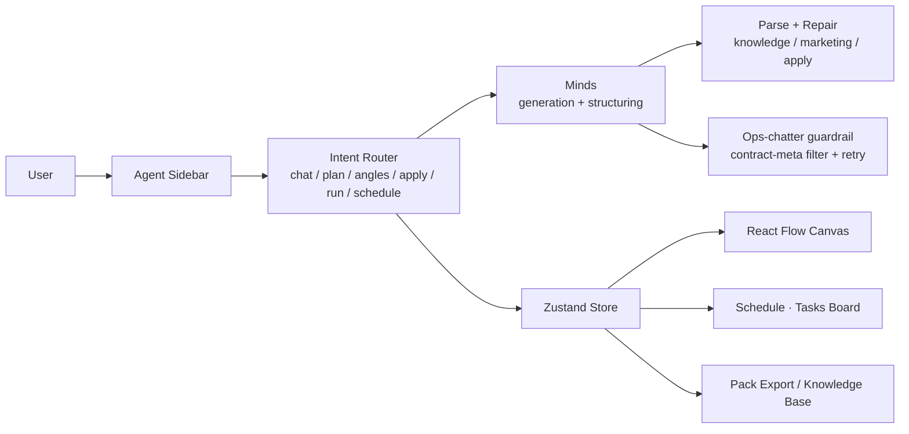
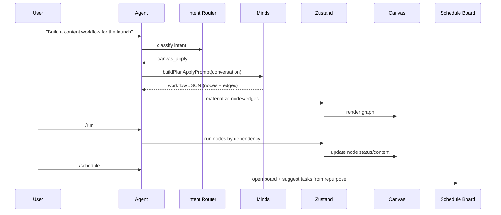
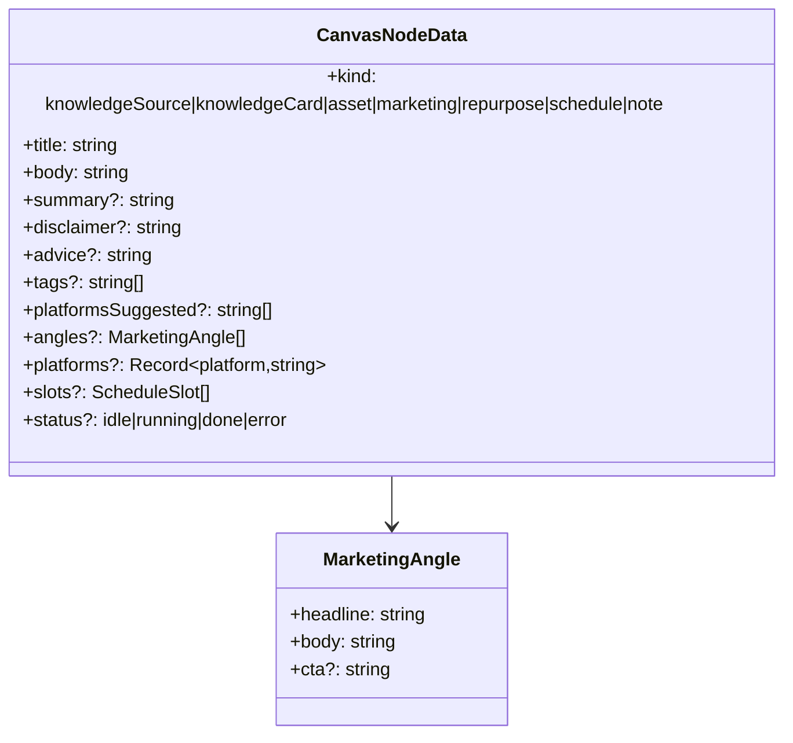
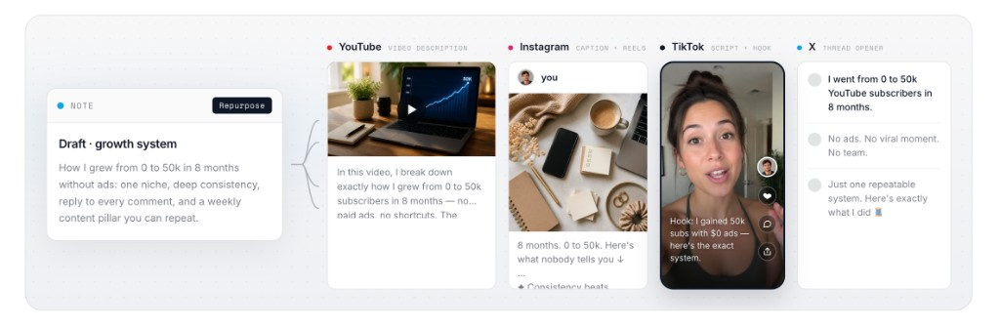

<table>
  <tr>
    <td valign="middle" width="460" align="center">
      
    </td>
    <td valign="middle">
      <h1>Chirp</h1>
      
<strong>Orchestrate content, don’t just generate it.</strong>

      
One canvas: Knowledge → Marketing → Repurpose → Schedule.

      

        
        
        
        
        
        
      

      
<em>中文摘要：一张画布跑通内容工作流，Agent 直接驱动，知识、角度、文案、排期全程可复用。</em>

    </td>
  </tr>
</table>

---

## The Problem — Context Hell

Content strategy today lives in fragments: a ChatGPT thread here, a Telegram brainstorm there, a Notion doc nobody reopens. Every new campaign starts from zero — no shared state, no compounding knowledge, no traceable path from idea to published post.

- **Scattered context** — brand voice, audience insight, and past decisions are spread across tools that don’t talk to each other.
- **Restart every time** — each conversation re-explains the product from scratch; nothing accumulates.
- **No provenance** — when a post ships, nobody can trace which insight produced it, or reuse that insight for the next one.

## The Insight — Orchestration, not generation

AI short-drama teams don’t stop at a single image-model call — they orchestrate an entire episode inside a workbench: characters, shots, voiceover, editing, all as one connected pipeline. Content creation deserves the same treatment.

Chirp is a **vertical workbench for content creators**, built on **Minds**. Brand knowledge, marketing angles, cross-platform repurposing, and scheduling become one executable chain — not four separate prompts.

**Market & vision**

- The creator economy needs **reusable, collaborative, measurable** content operations — not another chat window.
- A canvas-first core is built for **integration and extension**: scheduling, publishing, analytics loops, team collaboration, more platforms.
- **Vision:** Chirp is the **orchestration layer** for content — models (Minds) upstream, publishing and operations downstream, and a durable, reusable knowledge layer in between.

  

## The Product — One canvas, one agent

  

Everything happens in one place, driven by one agent:

- **Plan** — describe the goal, get a step-by-step plan with canvas suggestions. `/plan`
- **Angles** — generate 3 marketing angles grounded in your brand knowledge. `/angles`
- **Apply** — land the plan as real nodes and edges on the canvas. `/apply`
- **Run** — execute the pipeline in dependency order; nodes fill with content. `/run`
- **Schedule** — open the Schedule · Tasks board with suggested slots. `/schedule`

## How it works

  

A typical session, end to end:

The domain model is deliberately simple — one node type, rich payloads:

## Cross-platform by default

  

A single marketing angle becomes four platform-native deliverables — a YouTube hook, an Instagram caption, a TikTok script, an X post — each respecting the platform’s tone and format, all traceable back to the same source insight.

## Engineering depth

**Intent routing & canvas awareness.** Slash commands plus regex classification map free-form messages to `chat | plan | deliverable_angles | canvas_apply | canvas_run | canvas_schedule | help`. A canvas context builder (`buildCanvasContext`) injects node kinds, counts, current selection, knowledge entries, and board tasks into every prompt, so the agent always sees what you see.

**Structured generation with parse + repair.** Knowledge cards, marketing `angles[]`, and apply-time workflow JSON are parsed strictly; on malformed output the agent retries once with a targeted repair suffix (`KNOWLEDGE_REPAIR_SUFFIX`, `MARKETING_REPAIR_SUFFIX`, `APPLY_REPAIR_SUFFIX`) instead of failing silently.

**Quality guardrails.** Contract/ops chatter detection (`isContractMetaReply`) runs across chat, plan, marketing, and apply paths. On detection the agent issues one repair; if the reply is still unusable, a friendly on-topic fallback is returned — PIVOT/TASK/contract text never reaches the user. Prompts additionally ban TASK-prefixes, contract IDs, and PIVOT-Ops outright.

**State & persistence.** Zustand holds projects, canvases, knowledge entries, and board tasks, persisted to `localStorage` (`chirp-store`). Each project gets its own Minds conversation alias (`chirp-${slug}-${Date.now()}`) via `/api/minds/init`, keeping contexts isolated. A pack export produces JSON/Markdown snapshots of the whole workspace.

**Reliability & testing.** Timeouts plus single-repair retries on every Minds call; typed failure modes (`marketing-unusable`, `apply-unusable`, `insufficient-upstream`) instead of generic errors. Offline structure asserts live in `scripts/assert-node-content.ts`, with live probes in `scripts/probe-node-quality.mjs` and `scripts/probe-matrix-full.mjs`.

## Quality & Reliability

- Ops-chatter guardrail, so internal task text never surfaces to users
- Parse-and-repair on all structured generation paths
- Offline asserts for node content structure, runnable in CI

## Built on Minds — core layer, not a wrapper

Chirp treats **Minds** as the upstream product layer for generation and structuring — not a chat window bolted on at the edge. The canvas, agent routing, and schedule board are the orchestration surface; Minds is what makes each node’s content real.

Why this is a **core layer**, not a wrapper:

- **Agent → canvas, not one-shot prompts.** Intent routing and guardrails land as real nodes and edges (`/plan`, `/apply`, `/run`, `/schedule`), so Minds output becomes durable workflow state.
- **Structured reuse across the chain.** Knowledge cards, marketing angles, and platform-native drafts are parsed, repaired, and reused — one insight fans out to YT / IG / TT / X instead of four disconnected chats.
- **Product-owned context.** Per-project Minds conversations and persisted canvas state keep capability inside Chirp’s workbench, not in a disposable thread.

**Minds is a core product layer, not a wrapper**. Chirp is built to that standard.

## Roadmap · Demo · Team

- Demo video — in progress
- More platforms, team collaboration, publishing integrations
- Team Chirp — thanks to Minds by Animoca Brands
- Built for a hackathon exploring vertical content-creation workflows on a canvas
