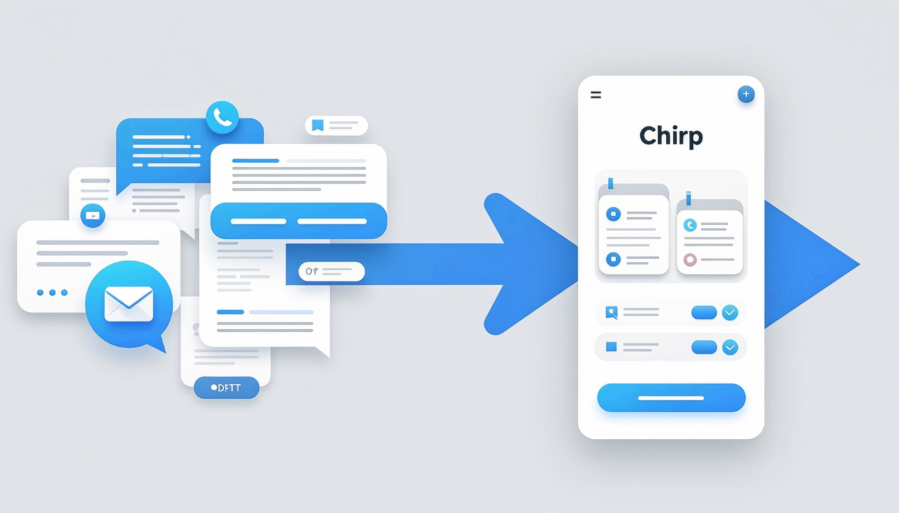
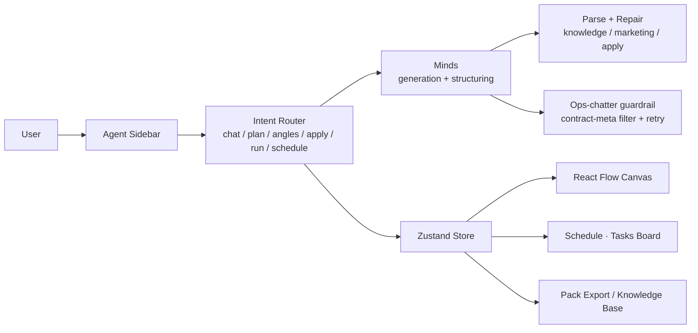
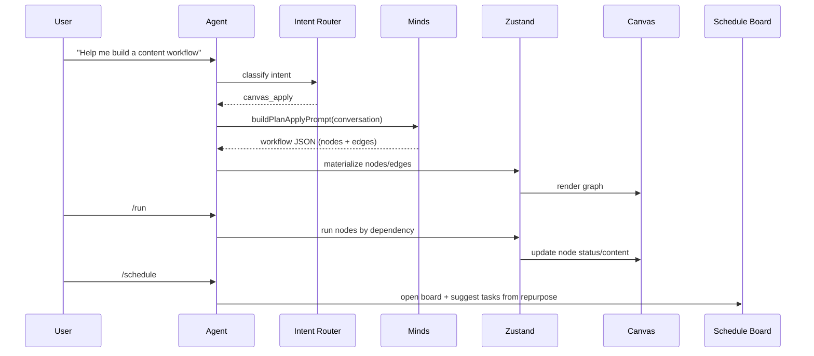
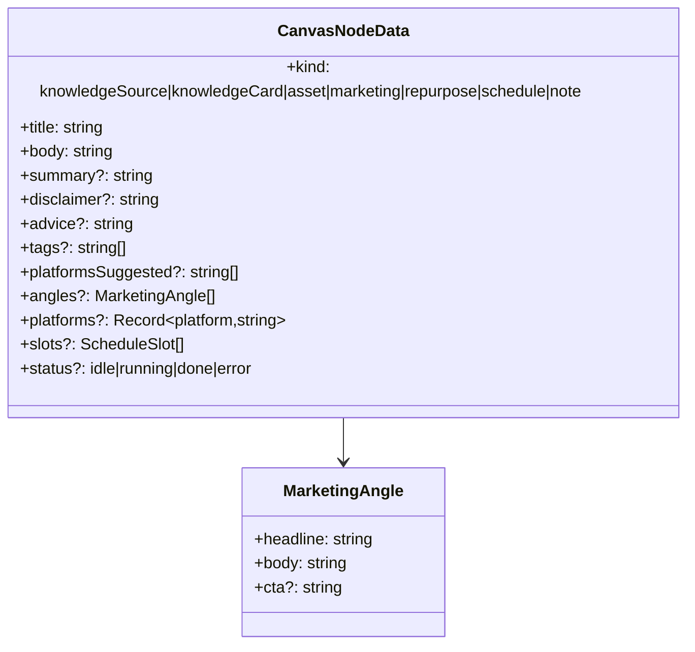

<div align="center">
  
  <h1>Chirp</h1>
  <p><strong>The canvas where content work becomes a workflow</strong></p>
  <p>Knowledge → Marketing → Repurpose → Schedule — orchestrated, not just generated.</p>

  <p>
    
    
    
    
    
    
    
  </p>
</div>

> **中文摘要**：Chirp 把「知识 → 营销 → 复用 → 排期」做成一张可执行画布，用 Agent 驱动画布，解决创作者在 Chat/TG 里的「上下文地狱」。基于 Minds 的垂直内容编排层：可复用、可协作、可扩展。

---

## 1. Problem — Context Hell

Creators and brands run strategy through scattered chat threads, Telegram groups, and docs. Every new conversation feels like a **restart**: no shared state, no reusable outputs, manual scheduling, and zero traceability. We call this **Context Hell** — the work exists, but it never compounds.

**Chirp turns conversation into an executable canvas workflow.** Knowledge, angles, copy, and schedule live on the same graph, flow through dependencies, and stay reusable.

<p align="center">
  
</p>

## 2. Why Vertical, Not “Just Call a Model”

Think **AI short drama / AI comic series**: creators don’t stop at “call an image model once.” They **orchestrate** characters, shots, scripts, pacing, and edits inside a workbench to ship a full episode. Content creation is the same — teams need **composable, reusable, extensible** workflows, not one-off fragments.

Chirp is a **vertical workbench for content creators**, built on **Minds**: brand knowledge, marketing angles, cross-platform repurposing, and scheduling are orchestrated into a single executable chain. AI doesn’t just “generate” — it **collaborates to run a full content pipeline**.

## 3. Market & Vision

- The creator economy keeps expanding; brands and teams need **reusable, collaborative, measurable** content operations, not scattered generation.
- A canvas-first core naturally supports **integration and extension**: scheduling, publishing, analytics loops, collaboration, and more platforms can grow on the same workflow.
- **Vision:** become the **orchestration layer** for content — model capabilities upstream, publishing and ops downstream, and a durable layer of reusable knowledge and process in between.

<p align="center">
  
</p>

## 4. Product Advantages

- **Chat → Canvas**: conversation isn’t the endpoint; the Agent lands plans as nodes and edges
- **Structured deliverables**: brand knowledge cards, marketing angles, platform-specific copy, schedule tasks — all reusable
- **Closed loop**: Knowledge → Marketing → Repurpose → Schedule in one place
- **Quality guardrails**: intent routing + structured parsing + repair, so “ops chatter” never reaches the UI
- **Compounding memory**: knowledge base + pack export, so learnings carry to the next project

<p align="center">
  
</p>

## 5. Agent Commands

| Command | What it does |
| --- | --- |
| `/plan` | Produce a step plan (direction / steps / canvas suggestions) |
| `/angles` | Draft 3 marketing angles into a canvas marketing node |
| `/apply` | Land the plan onto the canvas as nodes + edges |
| `/run` | Run the pipeline by dependency order |
| `/schedule` | Open the Schedule · Tasks board (schedule-only, no auto-publish) |

## 6. Architecture

### System context



### Data flow (apply → run → schedule)



### Canvas domain model



## 7. Engineering Depth

### Intent routing & canvas awareness
- Regex + slash commands map to `chat | plan | deliverable_angles | canvas_apply | canvas_run | canvas_schedule | help`
- A **canvas context** (`buildCanvasContext`) is injected into prompts: node kinds, counts, selection, knowledge entries, board tasks — the Agent answers **with the canvas in mind**

### Structured generation with parse + repair
- **Knowledge**: distill into a brand card; reject ops/contract meta or non-card output; single repair pass with `KNOWLEDGE_REPAIR_SUFFIX`
- **Marketing**: parse into `angles[]` grounded in upstream knowledge/assets; repair on parse/grounding failure (`MARKETING_REPAIR_SUFFIX`)
- **Apply**: strict JSON schema `{"status":"ready","workflow":{...}}` or `need_clarification`; repair with `APPLY_REPAIR_SUFFIX`

### Quality guardrails (no “task wall”)
- Contract/ops chatter detection (`isContractMetaReply`) across chat/plan/marketing/apply
- One repair attempt, then a **friendly, on-topic fallback** instead of surfacing PIVOT/TASK text
- Prompt-level bans: no TASK-prefix, no contract IDs, no PIVOT-Ops, no recapping prior threads

### State, persistence, export
- Zustand holds **projects, canvases, knowledgeEntries, boardTasks**, persisted to `localStorage` (`chirp-store`)
- Per-project Minds conversation alias (`chirp-${slug}-${Date.now()}`) created lazily via `/api/minds/init`
- **Pack export** (JSON/Markdown) for portability and review

### Reliability & testing
- Timeouts + single-repair retries; typed failure modes (`marketing-unusable`, `apply-unusable`, `insufficient-upstream`)
- Offline asserts: `scripts/assert-node-content.ts` (structure, meta stripping, grounding)
- Probe scripts: `scripts/probe-node-quality.mjs`, `scripts/probe-matrix-full.mjs`

## 8. Quickstart

```bash
pnpm install
pnpm dev
```

Required environment variables:

```bash
MINDS_BUILDER_API_KEY=...
MINDS_MIND_ID=...
```

## 9. Deploy

Vercel: set the two Minds variables above. Same-origin env; avoid `NEXT_PUBLIC_APP_URL` unless you actually use it.

## 10. Quality & Reliability

- Intent routing + structured parsing + repair
- Ops-chatter guardrail so “task walls” never surface
- Offline asserts for node content structure

## 11. Roadmap / Demo

- Demo video (in progress)
- More platforms, team collaboration, publishing integrations

## 12. Team / Acknowledgements / Hackathon

- Team: Chirp
- Thanks: Minds by Animoca Brands, React Flow, Vercel
- Built for a hackathon exploring vertical content-creation workflows on a canvas

---

> Illustrations generated with Alibaba DashScope (Wanx T2I) for this README.
